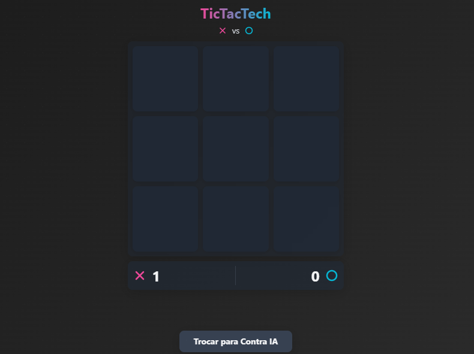

<div align="center">

# 🎮 TicTacTech

> Um jogo da velha reimaginado para a era moderna

[](https://react.dev/)
[](https://www.typescriptlang.org/)
[](https://tailwindcss.com/)
[](https://vitejs.dev/)

[🎯 Funcionalidades](#-funcionalidades) •
[🚀 Instalação](#-instalação) •
[🎮 Como Jogar](#-como-jogar) •
[🧠 IA](#-inteligência-artificial)



</div>

## ⭐ Destaques

- 🎨 **Design Moderno**: Interface elegante com tema escuro e animações suaves
- 🤖 **IA Avançada**: Algoritmo Minimax com poda Alpha-Beta para jogadas inteligentes
- 🌐 **Responsivo**: Adaptação perfeita para qualquer dispositivo
- 🚀 **Performance**: Construído com tecnologias modernas para máxima eficiência

## 🎯 Funcionalidades

### 🎮 Modos de Jogo
- `👥 Multiplayer Local`: Desafie seus amigos em duelos emocionantes
- `🤖 Contra IA`: Enfrente nossa IA imbatível em três níveis de dificuldade

### 🎨 Interface
- `✨ Animações`: Transições suaves e feedback visual imediato
- `🌙 Tema Dark`: Visual elegante e confortável para os olhos
- `📱 Responsivo`: Jogue em qualquer dispositivo, de celulares a desktops

### 🏆 Sistema de Pontuação
- `📊 Placar`: Acompanhe as vitórias de cada jogador
- `🎉 Celebrações`: Animações especiais para vitórias e empates

## 🚀 Instalação

```bash
# 📦 Clone o repositório
git clone https://github.com/seu-usuario/tic-tac-toe.git

# 📂 Entre no diretório
cd tic-tac-toe

# ⚡ Instale as dependências
npm install

# 🎮 Inicie o jogo
npm run dev
```

## 🎮 Como Jogar

### 🎯 Regras Básicas
1. **Escolha o Modo**: 
   - `👥 2 Jogadores`: Jogue localmente com um amigo
   - `🤖 Contra IA`: Desafie nossa IA inteligente

2. **Faça sua Jogada**:
   - `❌ Jogador 1`: Usa X (rosa)
   - `⭕ Jogador 2/IA`: Usa O (azul)

3. **Para Vencer**:
   - Complete uma linha ↔️
   - Complete uma coluna ↕️
   - Complete uma diagonal ↗️↙️

## 🧠 Inteligência Artificial

Nossa IA utiliza algoritmos avançados para proporcionar um desafio real:

### 🤖 Características
- `🎯 Previsão`: Analisa múltiplas jogadas à frente
- `📊 Avaliação`: Pondera cada possível movimento
- `⚡ Otimização`: Poda Alpha-Beta para respostas rápidas

## ⚙️ Scripts

```bash
npm run dev     # 🚀 Inicia o servidor de desenvolvimento
npm run build   # 📦 Gera versão de produção
npm run preview # 👀 Visualiza a versão de produção
npm run lint    # 🔍 Verifica o código
```

## 👨‍💻 Autor

**Eduardo Genes**
- 📧 [eduardogenes95@gmail.com](mailto:eduardogenes95@gmail.com)
- 💼 [LinkedIn](https://linkedin.com/in/eduardogenes)
- 🐱 [GitHub](https://github.com/eduardogenes)

## 📄 Licença

Este projeto está sob a licença MIT - veja o arquivo [LICENSE](LICENSE) para detalhes.

---

<div align="center">

Feito com 💜 por Eduardo Genes

[⬆ Voltar ao topo](#-tictactech)

</div>
